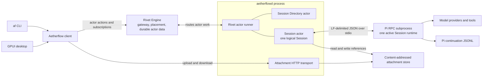
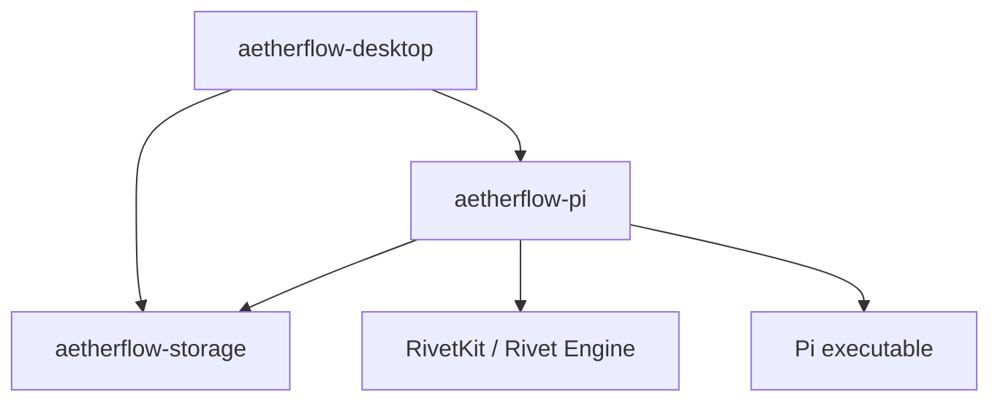

# Aetherflow Architecture

This is the entry point for Aetherflow's current architecture. It describes the
implemented local-first Session product; future hosted behavior is explicitly
separated into [Session Promotion](../session-promotion.md).

## Documentation map

- [Domain language](../../CONTEXT.md) defines Aetherflow terms without
  implementation details.
- [Local Session contract](local-sessions.md) specifies behavior, interfaces,
  runtime collaboration, and verification.
- [Persistence](persistence.md) identifies every source of truth and derived
  view.
- [Invariant registry](invariants.md) gives stable identifiers to constraints
  that must survive refactors.
- [Architecture decisions](../adr/README.md) records costly and non-obvious
  trade-offs.
- [Session Promotion](../session-promotion.md) is a future contract, not current
  behavior.

## Current product boundary

Aetherflow currently provides local, durable, private Pi-backed Sessions through
a GPUI desktop app and the `af` CLI. The domain models Agents, Channels, and
Session Association, but the end-to-end product currently exercises standalone
Sessions and a default local Agent. Channel participation, hosted authority, and
Session Promotion are not implemented product flows.

## System map

Rivet Engine is a separate local process. `aetherflowd` configures or starts the
vendored Engine, registers the actor implementations, and serves attachment
bytes. Clients enter through the Engine for actor work and through the daemon's
attachment transport for binary media.

## Responsibilities

| Module | Owns | Must not own |
| --- | --- | --- |
| `aetherflow-storage` | Domain IDs and serializable Agent, Channel, Session, Session Association, status, and Attachment reference shapes | Persistence engines, actor lifecycles, Pi protocol behavior, or UI state |
| GPUI desktop | User interaction, optimistic display state, transcript rendering, daemon discovery and launch | Authoritative Session history, actor state, or Pi continuation |
| `af` CLI | Scriptable access to the same client contract and direct diagnostic access to ephemeral Pi RPC | A separate backend or a second Session model |
| Aetherflow client | Multi-actor workflows, cursored event observation, attachment transfer, and typed client-facing operations | Durable data of its own or UI policy |
| `aetherflowd` | Local process supervision, actor registration, bundled Engine configuration, attachment HTTP transport, readiness metadata | Session identity or conversation history |
| Rivet Engine | Actor placement, routing, lifecycle, state, and per-actor SQL persistence | Pi message semantics, transcript rendering, or attachment bytes |
| Session Directory actor | Durable discovery and sidebar metadata for many Sessions | Session runtime state, conversation history, or Pi processes |
| Session actor | One Session's durable configuration, command serialization, Pi process lifecycle, and sequenced event history | Cross-Session listing or raw attachment bytes in actor messages |
| Pi RPC subprocess | The agent loop, model/tool execution, and Pi continuation format | Aetherflow Session discovery, durable event cursors, or Channel semantics |
| Attachment store | Immutable content-addressed bytes and integrity metadata | Message order, Session ownership, or UI previews |

## Dependency direction

The desktop package owns the distributable `aetherflow-desktop` and
`aetherflowd` binaries so one install produces a matched pair. The daemon's
implementation remains in `aetherflow-pi`; the binary in the desktop package is
only its process entry point. The `af` binary remains in `aetherflow-pi`.

## Keeping the docs synchronized

Any change to component ownership, process topology, persisted authority,
public interfaces, daemon protocol compatibility, or an invariant in
[the registry](invariants.md) MUST update these docs in the same commit.

Use this routing checklist:

- domain meaning or canonical terminology: update `CONTEXT.md`;
- component ownership or process topology: update this system map;
- Session behavior or an exposed interface: update the Local Session contract;
- a source of truth, cache, projection, or write order: update Persistence;
- a constraint that must survive refactors: update the Invariant Registry and
  name its verification;
- a costly, surprising trade-off: add or supersede an ADR; and
- future behavior: keep it in an explicitly future or proposed contract.

Accepted ADRs are historical records. A changed decision MUST supersede an ADR
rather than silently rewriting its rationale. Proposed work MUST be labeled as
future or proposed and MUST NOT be described in this architecture map as
implemented behavior.
