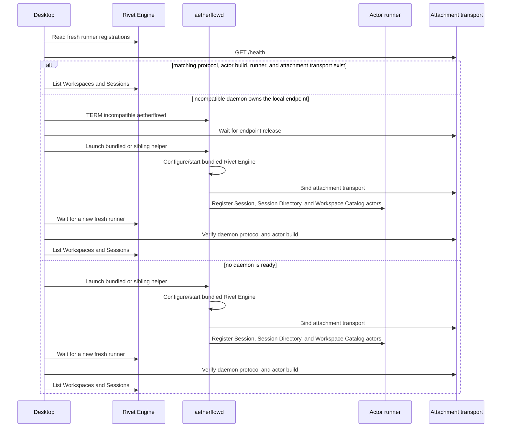
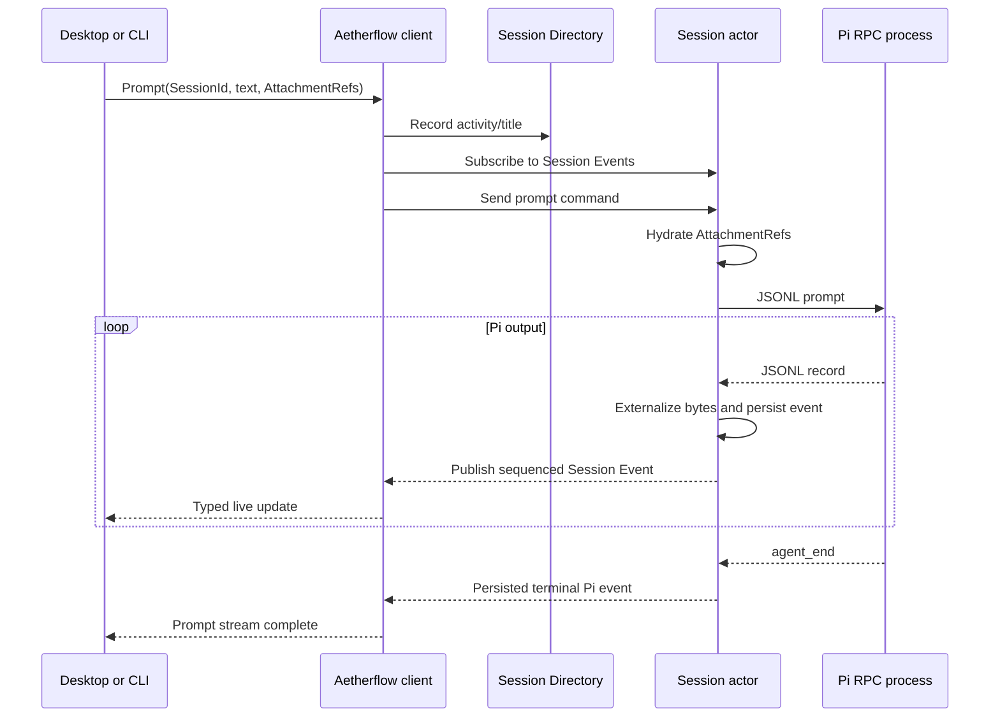

# Local Session Contract

## Purpose

Local Sessions let a user create a private, durable interaction with a Pi agent,
leave it running without an attached UI, reconnect later, and replay only the
history they have not yet observed.

## Scope

This contract covers local Session creation within a Workspace, prompting,
cancellation, observation, listing, archiving, attachments, daemon startup, and
process recovery. Filesystem placement is specified by the
[Local Workspace contract](workspaces.md).

It does not currently provide:

- Channel participation or shared Channel history;
- more than one authoritative host for a Session;
- transparent migration of a running Pi process;
- remote authentication or multi-user authorization;
- deletion or garbage collection of Sessions and Attachments; or
- atomic transactions across the Session actor, Session Directory actor, Pi
  filesystem, and Attachment store.

## Behavior contract

### Identity and privacy

- A Session MUST have one stable `SessionId` and one stable `AgentId`.
- Every newly created Session MUST select one Directory from one Workspace.
- Every newly created Session MUST append all of its Workspace Directory paths
  to Pi's system context and identify which one is the process working
  Directory.
- The `SessionId` MUST be the logical Session identity, the Rivet actor key, and
  the persistent Pi session ID.
- A Session MUST be either standalone or associated with exactly one Channel by
  the `SessionAssociation` discriminator.
- Channel association MUST NOT imply that the Session is public or that the
  Agent participates in the Channel.
- A Rivet physical actor ID or operating-system process ID MUST NOT become a
  domain identity.

### Runtime and lifecycle

- A durable Session actor MUST use persistent Pi storage; an ephemeral Pi
  process is valid only for direct diagnostics.
- An active Session actor MUST own exactly one headless Pi RPC subprocess.
- Pi MUST run in `--mode rpc` and exchange one JSON object per LF-delimited
  record over stdin and stdout.
- The Pi process MUST be treated as replaceable runtime state. Its persisted
  continuation and Aetherflow Session identity survive process replacement.
- Closing the desktop MUST NOT terminate a daemon it launched. Detached turns
  may continue, and later desktop or CLI clients may reconnect.
- The desktop MUST use an already-running daemon only when its runner is fresh
  and its daemon protocol is compatible. Otherwise it MUST launch its bundled
  or sibling helper and wait for both actor and attachment readiness.
- When an incompatible `aetherflowd` owns the configured loopback attachment
  endpoint, the desktop MUST stop that process and wait for the endpoint to be
  released before launching its replacement. It MUST NOT terminate an unknown
  process or act through a non-loopback endpoint.

### Commands and events

- Session commands MUST pass through the Session actor so one actor owns command
  ordering for one Pi process.
- Every Pi stdout record and terminal Session failure MUST become a Session
  Event.
- A Session Event MUST be persisted before it is published live.
- Event sequence numbers MUST be positive, monotonically increasing, and scoped
  to one Session.
- Cursor reads MUST be exclusive (`sequence > after`) and bounded to at most
  1,000 events per page.
- Replay-to-live following MUST subscribe before replay and suppress any live
  event whose sequence was already replayed.
- A prompt-scoped stream MUST finish on Pi `agent_end` or a terminal Session
  failure. Durable following remains a separate, open-ended observation mode.
- Known Pi records SHOULD decode into distinct Rust union variants. Unknown Pi
  event kinds MUST retain their raw JSON object so protocol additions do not
  destroy fields; inline Attachment bytes remain subject to externalization.

### Discovery metadata

- Session listing MUST read the Session Directory rather than waking or
  scanning every Session actor.
- A Session descriptor MUST contain only identity plus navigation metadata:
  Workspace placement, title, archive state, and last activity time.
- A descriptor MUST NOT be treated as authoritative conversation history or
  complete runtime state.
- Archiving MUST hide a Session from the active desktop list without deleting
  its actor, event history, Pi continuation, or Attachments.
- `Cmd-Shift-A` MUST archive the selected unarchived Session. It MUST do nothing
  when there is no selected Session or the selected Session is already archived.
- The desktop MUST group archived Sessions under a plain-text `Archived`
  heading. Clicking that heading MUST toggle the archived rows without changing
  any Session's archive state.
- The `Archived` heading MUST NOT use a chip or disclosure icon. Its expanded or
  collapsed state is desktop preference state that MUST survive an app relaunch
  and MUST NOT be persisted as Session metadata.
- Clicking a Workspace header MUST toggle the visibility of its active Session
  rows without changing Workspace or Session data. Its open or closed state is
  desktop preference state and MUST survive an app relaunch.

### Attachments

- Actor commands and persisted Session Events MUST carry Attachment references,
  not inline binary payloads.
- Attachment bytes MUST be hydrated into base64 only at the Pi stdin seam and
  externalized again before a Pi record is persisted or published.
- An Attachment reference MUST include a SHA-256 identity, media type, and byte
  length. Reads MUST validate both digest and length.
- The local attachment transport MUST currently accept only PNG, JPEG, GIF, and
  WebP images up to 25 MiB each.

## Interfaces

### User interfaces

- The desktop groups active Sessions beneath their named Workspaces, lists
  archived Sessions, creates multi-Directory Workspaces and Sessions, opens
  durable transcript history, prompts and cancels turns, and renders live Pi
  text/tool activity.
- `af workspace` exposes create, list, and add-Directory operations.
- `af session` exposes create, list, state, archive, unarchive, prompt, and
  cursored event operations against the same client contract.
- `af pi` starts an ephemeral Pi process for direct protocol diagnostics and is
  not a durable Aetherflow Session.

### Client interface

`AetherflowClient` is the semantic seam for Workspace and Session workflows. It
registers and lists Workspaces, resolves a Session's selected Directory, creates
and registers Sessions, updates discovery metadata, sends commands, reads state
and events, follows replay plus live events, and transfers Attachments. Callers
do not need to coordinate raw Rivet actor handles.

### Actor interface

The Session actor accepts typed commands, state reads, and bounded event reads;
it emits `SessionEvent`. The Session Directory accepts registration, listing,
activity, and archive mutations. The Workspace Catalog accepts Workspace
registration, listing, lookup, and Directory additions. These interfaces are
separate because their lifecycles and read patterns differ.

### Process and transport interfaces

- Client to Rivet Engine: HTTP/WebSocket transport managed by RivetKit.
- Session actor to Pi: strict LF-delimited JSON over child stdin/stdout.
- Client to attachment store: daemon-local HTTP upload/download.
- Desktop to daemon: process launch plus Engine envoy and attachment health
  probes.

## Implementation model

### Startup



### Prompt and streaming



### Replay and follow

The client subscribes before reading history. It then reads bounded pages after
the caller's cursor, records the last replayed sequence, and begins consuming
the subscription. Live events at or below that sequence are duplicates from the
overlap window and are discarded.

This ordering prevents the gap that would occur if an event were emitted after
the last replay query but before live subscription.

## Verification

Run the complete deterministic suite:

```sh
cargo test --workspace
cargo clippy --workspace --all-targets -- -D warnings
```

Run the local lifecycle acceptance flow with a real Rivet Engine and headless Pi:

```sh
scripts/smoke-session-lifecycle.sh
```

For the desktop archive disclosure, verify manually that clicking the plain
`Archived` heading hides and restores the archived rows, while restarting the
desktop restores the most recently chosen disclosure state and does not change
which Sessions are archived.

For Workspace disclosure, verify manually that clicking a Workspace header
hides and restores only that Workspace's active Session rows, that its `+`
action starts a Session without toggling the group, and that restarting the
desktop restores each Workspace's most recently chosen state.

The following tests are the contract anchors:

| Contract | Test |
| --- | --- |
| Session association is explicit | `session_association_has_an_explicit_wire_discriminator` |
| Persistent actor identity matches Pi identity | `config_rejects_a_different_pi_session_identity` |
| Session actors reject ephemeral Pi storage | `config_requires_persistent_pi_storage` |
| Event pages are bounded | `event_page_limit_is_bounded` |
| Replay uses persisted sequence | `persisted_event_rows_recover_their_sequence` |
| Replay plus live suppresses overlap | `client_creates_lists_prompts_and_resumes_a_session` |
| Pi records remain typed and forward-compatible | `unknown_event_round_trips_without_losing_fields` |
| Actor messages exclude attachment bytes | `large_prompt_attachments_stay_outside_the_actor_message` |
| Persisted events externalize attachment bytes | `externalized_events_carry_references_instead_of_base64` |
| Desktop rejects stale daemon health | `rejects_the_legacy_protocol_one_health_response` and `rejects_an_incompatible_daemon_protocol` |

The Rivet lifecycle tests are ignored by default because they require a local
Engine. The smoke script exercises that integration.
