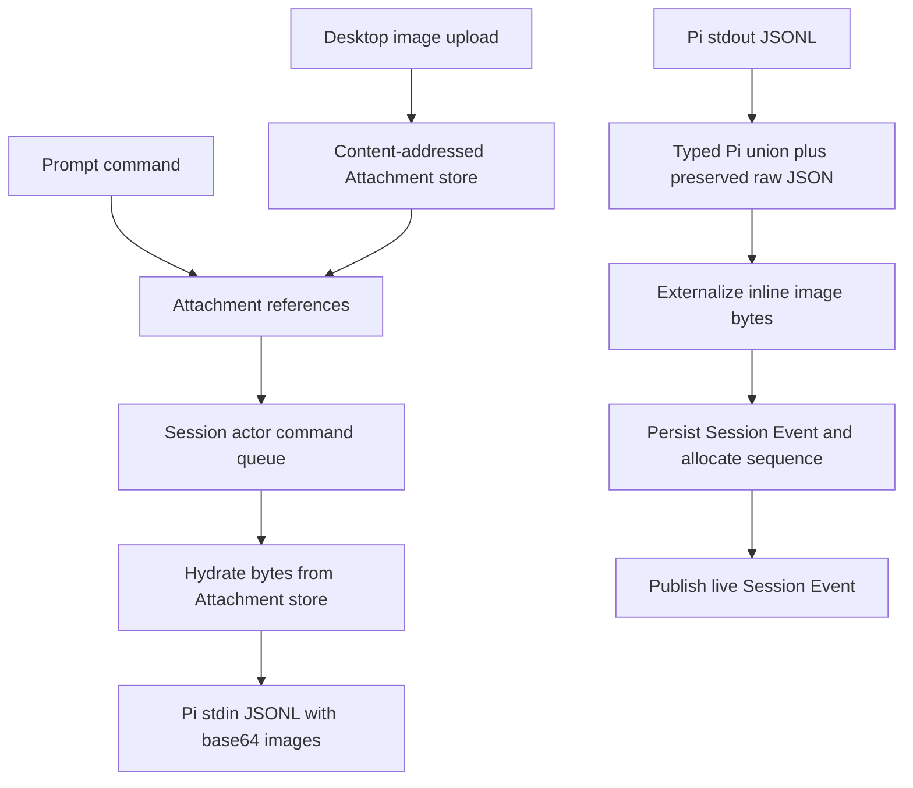

# Persistence and Authority

## Purpose

Aetherflow stores related Session information in several places because actor
state, resumable observation, Pi continuation, discovery, and binary media have
different access patterns. This document identifies the authority for each kind
of data so a cache or projection is not accidentally promoted into a source of
truth.

## Authority table

| Data | Authority | Key | Survives | Notes |
| --- | --- | --- | --- | --- |
| Named Workspace definitions and Directory membership | Workspace Catalog actor SQL | `WorkspaceId` | Catalog sleep and daemon restart | Paths are canonical, host-local configuration; directory contents are not stored. |
| Session identity, Agent identity, association, Workspace placement, Pi configuration | Session actor state in Rivet | `SessionId` actor key | Actor sleep and daemon restart | The selected Directory is materialized as Pi's concrete `cwd`; Workspace roots are snapshotted as appended system context. The physical Rivet actor ID is not domain identity. |
| Ordered observable Session history | Session actor SQL `session_events` | Per-Session autoincrement sequence | Client disconnect, actor sleep, daemon restart | Payloads contain Pi records or a terminal stopped event. |
| Pi conversation continuation | Pi session JSONL | Aetherflow `SessionId` | Pi process and daemon restart | Pi owns the continuation format; Aetherflow does not reconstruct it from Session Events. |
| Session discovery and navigation metadata | Session Directory actor SQL | `SessionId` | Directory sleep and daemon restart | Title, archive state, and activity time are a dedicated read model. |
| Attachment bytes and integrity metadata | Local content-addressed filesystem store | SHA-256 `AttachmentId` | Process restart | Repeated uploads deduplicate; Session commands and events store references only. |
| Desktop presentation preferences | Local `desktop-preferences.json` | Host user | App relaunch | Presentation only; currently remembers whether the archived Sessions section is collapsed. |
| Live event delivery | Rivet subscription | Connection plus Session actor | No | A transient acceleration over durable history. |
| Desktop transcript and optimistic composer state | GPUI process memory | `SessionId` | No | Derived from Session Events and current user actions. |

By default, Pi continuation lives under `~/.aetherflow/pi-sessions`, Attachments
under `~/.aetherflow/attachments`, and desktop preferences at
`~/.aetherflow/desktop-preferences.json`. `AETHERFLOW_DATA_DIR` relocates these
default Aetherflow-managed filesystem stores; callers may also choose a Pi
session directory explicitly. Rivet Engine manages its own local actor
persistence according to its configuration.

## Write paths

Persistence precedes publication on the event path. A subscriber may therefore
recover an emitted event from durable replay after disconnecting.

## Read paths

Workspace listing reads only the Workspace Catalog. Session listing reads only
the Session Directory, whose descriptors project Workspace placement. Opening a
transcript pages through one Session actor's event log from sequence zero,
downloads referenced Attachments, hydrates those records for display, and
derives conversation messages and tool groups in memory.

Durable following subscribes before replay, then filters subscription overlap by
sequence. Live subscriptions are not authoritative: after any interruption the
consumer resumes with its last durable sequence.

## Cross-store boundaries

There is no transaction spanning these authorities. In particular:

- Session actor creation and Session Directory registration are separate actor
  actions.
- Workspace registration and Session creation are separate actor actions.
- Directory activity may be recorded before a prompt command is accepted.
- Attachment upload completes before its reference is sent to a Session actor.
- Pi may persist its own continuation independently of Aetherflow's event
  insertion.

Callers MUST surface partial failures. Any automatic retry MUST be limited to an
operation whose interface makes that retry idempotent. Future hosted promotion
must transfer Aetherflow-owned data through a versioned bundle rather than
copying Rivet's physical storage files.

## Data that must remain derived

- The desktop Session list is derived from Session descriptors.
- The desktop Workspace groups are derived from Workspace Catalog entries and
  descriptor placement.
- Rendered transcript messages, Markdown, tool groups, activity indicators, and
  scroll state are derived UI state.
- A Session descriptor's title and timestamp are navigation metadata, not proof
  of the latest persisted event.
- Live `SessionStatus` describes actor lifecycle and MUST NOT replace the durable
  event history or Pi continuation.
