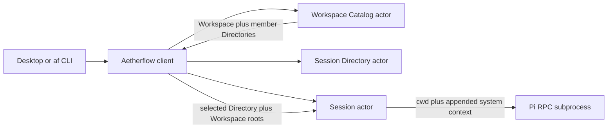

# Local Workspace Contract

## Purpose

Workspaces let local Pi-backed Sessions run in an explicit filesystem context.
A Workspace collects one or more Directories, while each Session selects
exactly one of those Directories as Pi's working directory.

## Scope

This contract covers named local Workspace registration, durable discovery,
multi-Directory membership, Session placement, CLI access, and desktop
navigation.

It does not currently provide:

- filesystem sandboxing or permission enforcement;
- live propagation of Directory additions into existing Sessions;
- Workspace removal, reordering, or a persisted recent-Workspace list;
- portable filesystem paths across machines; or
- Channel ownership of, or membership in, a Workspace.

## Behavior contract

### Workspace and Directory identity

- A Workspace MUST have a non-empty user-facing name.
- A Directory MUST identify exactly one absolute, canonical filesystem root.
- A Workspace MUST contain at least one Directory.
- A Workspace MUST identify one member as its primary Directory.
- A Workspace MUST NOT contain the same canonical path more than once.
- Workspace membership MUST be independent of Channel association.
- Registering a path MUST fail when the path does not exist or cannot be
  canonicalized.

### Session placement

- Every newly created durable Session MUST identify one Workspace and one
  working Directory within that Workspace.
- Omitting the Directory when creating a Session MUST select the Workspace's
  primary Directory.
- Session creation MUST fail before starting Pi when the Workspace is unknown,
  the Directory is not a member, or its path is no longer available.
- Pi MUST receive the selected Directory path as its one process `cwd`.
- Pi MUST receive appended system context that lists every Workspace Directory,
  marks the selected working Directory, and tells the agent to use absolute
  paths for other roots.
- Other Directories in the Workspace MUST NOT be implied additional working
  directories or treated as sandbox permissions.
- A Session's Workspace placement and Channel association MUST remain separate
  discriminated fields.
- A Session without Workspace placement MUST be rejected as invalid persisted
  state rather than represented as an unscoped variant.

### Discovery

- Workspace listing MUST read one durable Workspace Catalog actor rather than
  derive Workspaces from Sessions.
- The Workspace Catalog MUST own Workspace definitions, not Session history or
  runtime state.
- Session descriptors MUST project Workspace and working-Directory identity so
  navigation does not wake each Session actor.
- The desktop MUST group active Sessions beneath their named Workspace.
- Creating a Session from a Workspace MUST select its primary Directory unless
  an existing Session established another member as the current context.

## Interfaces

### CLI

```sh
af workspace create --name "My workspace" --directory /absolute/path \
  --directory /another/absolute/path
af workspace list
af workspace add-directory <WORKSPACE_ID> /third/absolute/path

af session create --workspace <WORKSPACE_ID> \
  --directory <DIRECTORY_ID> "Inspect this codebase"
```

`--directory` is optional on `session create`; the Workspace primary is used
when it is absent.

### Desktop

The sidebar groups Sessions by Workspace. Its add action opens an in-app modal
that requires a name and lets the user select one or more roots through the
native macOS directory picker. Creating a Session from a Workspace uses its
primary Directory; `Cmd-N` preserves the current Workspace and Directory when
possible.

### Client and actors

`AetherflowClient` owns the multi-actor workflow: it canonicalizes paths,
registers or reads the Workspace, resolves the selected Directory, creates the
Session actor with the concrete Pi `cwd` and Workspace filesystem context, and
registers its descriptor.

The Workspace Catalog accepts typed register, list, get, and add-Directory
actions. The Session actor remains the authority for one Session, and the
Session Directory remains the read model for Session navigation.

## Implementation model



Workspace paths are host-local configuration. The catalog stores logical IDs
and canonical paths; it does not copy directory contents. A Session snapshots
the Workspace roots into Pi's appended system context when it is created.
Adding a Directory changes future Sessions and does not relocate or rewrite an
existing Session.

## Verification

Run:

```sh
cargo test --workspace
cargo clippy --workspace --all-targets -- -D warnings
cargo run -p aetherflow-pi --bin af -- workspace create --help
cargo run -p aetherflow-pi --bin af -- session create --help
```

Contract anchors include tests that reject empty and relative Workspaces,
accept multiple Directories, preserve the selected IDs in the Session
descriptor, pass the selected path to Pi, and retain the Workspace Catalog
across actor-runner restart.

## Notes

- Canonicalizing at registration makes duplicate detection and later display
  stable for the local host.
- A single Pi process has one `cwd`; selecting one Directory keeps that runtime
  boundary explicit even though the system context identifies every root.
- Directory paths require explicit rebinding during future Session Promotion.
