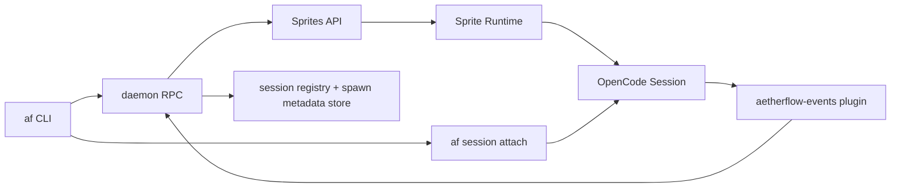

# Sprites-first remote agent spawn with session attach

## Overview

Enable Aetherflow to spawn agents in Sprites and attach humans to those remote sessions using the existing `af session attach` workflow.

MVP is intentionally narrow:

- Spawn remote agent runtime on Sprites.
- Capture and persist enough metadata to re-attach.
- Keep provider-native escape hatches (users can use `sprite` CLI/API directly after spawn).

Out of scope for MVP:

- Multi-provider abstractions/adapters.
- AF-managed wrappers for every provider capability (port logs, previews, desktop views).

## Problem Statement / Motivation

Today, `af` is effectively local-only for attach targets and server URL validation (`internal/daemon/server_url.go:10`). This blocks the immediate goal: run agents remotely while keeping Aetherflow as orchestration entrypoint.

Without a minimal remote spawn path, users cannot:

- Offload execution to remote sandbox infra.
- Keep local machine clean/lightweight.
- Share persistent agent environments while still using Aetherflow session UX.

## Proposed Solution

Add a Sprites-specific MVP flow with strict boundaries:

1. `af spawn --provider sprites ...` (or equivalent config-driven mode) requests a remote Sprite and starts agent execution there.
2. Aetherflow persists spawn/session routing metadata in local registry/state.
3. `af sessions` and `af session attach <session-id>` continue to work, now including Sprites-backed sessions.
4. All non-core follow-up interactions (advanced networking, deep logs, custom control) remain provider-native via Sprites CLI/API.

## Research Summary

### Local findings used for this plan

- Existing spawn and attach flows are already server-first and registry-backed: `cmd/af/cmd/spawn.go:61`, `cmd/af/cmd/sessions.go:339`, `internal/sessions/store.go:120`.
- Current server URL validation only permits localhost/127.0.0.1 and blocks remote targets: `internal/daemon/server_url.go:25`.
- Daemon/event model and plugin pipeline are in place and should be reused rather than replaced: `internal/daemon/daemon.go:347`, `internal/install/plugins/aetherflow-events.ts:56`.
- Existing roadmap/docs explicitly reference remote sandboxes/Sprites direction: `README.md:648`.

### Institutional learnings applied

- Path/input validation must happen at boundaries; keep defense in depth for IDs and paths: `docs/solutions/security-issues/path-traversal-validation-pattern-20260210.md`.
- Project/socket isolation and process isolation patterns are security-critical when expanding orchestration surfaces: `docs/solutions/security-issues/daemon-cross-project-shutdown-socket-isolation-20260207.md`.
- Constructor defaults for non-YAML fields prevent nil-panic regressions in daemon/RPC surfaces: `docs/solutions/runtime-errors/nil-pointer-status-handler-runner-not-set-20260207.md`.
- Reconcile orphaned state on restart to recover from partial/crash states: `docs/solutions/runtime-errors/orphaned-in-progress-tasks-reclaim-on-startup-20260207.md`.

### External findings used for this plan

- Sprites supports create/exec/proxy primitives and token auth for automation: `https://sprites.dev/api/sprites`, `https://sprites.dev/api/sprites/exec`, `https://docs.sprites.dev/cli/authentication/`.
- Sprites lifecycle and persistence model is suitable for long-lived agent sessions (warm/cold, persistent filesystem): `https://docs.sprites.dev/working-with-sprites/`.
- Security baseline for external integration should include strict HTTPS/TLS validation, allowlist-style trust policy, and idempotent request behavior: `https://cheatsheetseries.owasp.org/cheatsheets/Transport_Layer_Security_Cheat_Sheet.html`, `https://cheatsheetseries.owasp.org/cheatsheets/Server_Side_Request_Forgery_Prevention_Cheat_Sheet.html`, `https://google.aip.dev/155`.

## Technical Considerations

- **Security**
  - Remote target policy must default to secure values (HTTPS, cert validation, explicit trust config).
  - Sprites credentials should be sourced securely (env/OS keychain path), never logged, and redacted in status/errors.
- **Correctness**
  - Spawn must be idempotent to avoid duplicate remote environments on retries.
  - Local/remote state divergence must converge via reconcile loop.
- **Observability**
  - Attach lifecycle should emit consistent start/end events with `request_id`, `provider`, `sandbox_id`, `session_id`, status, and duration.
- **Compatibility**
  - Existing non-remote spawn path must remain intact.
  - Existing `af session attach` UX should remain unchanged for end users.

## Operational Contracts (MVP)

### Canonical identity and handle contract

- Aetherflow creates and returns a canonical `spawn_id` for every remote spawn request.
- `spawn_id` is the only guaranteed handle before `session_id` is discovered.
- `session_id` becomes an alias once known; both must resolve to the same canonical spawn record.
- `af sessions` must show both fields when available.
- `af session attach <id>` resolution order: exact `session_id` match, then exact `spawn_id` match, else error.

Persistence requirement:

- `spawn_id` is persisted as first-class field and indexed for lookup.
- `session_id` is optional index that may be null until discovery completes.

Golden-path CLI behavior:

```text
af spawn --provider sprites "prompt"
-> state=spawning spawn_id=spn_123 session_id=<pending>

af session attach spn_123
-> pending: session not attachable yet (exit 3)

af session attach ses_abc
-> attaches normally once running (exit 0)
```

### Spawn/attach state machine

| State | Meaning | Allowed transitions | Attach behavior |
|---|---|---|---|
| `requested` | Request accepted locally; remote create not started yet | `spawning`, `failed` | Returns pending message with retry hint |
| `spawning` | Remote provider call in progress | `running`, `failed`, `unknown` | Returns pending message with current provider operation id if available |
| `running` | Remote runtime exists and session is attachable | `terminated`, `unknown` | Normal attach path |
| `failed` | Spawn failed with terminal non-retryable error | none | Attach rejected with actionable reason |
| `terminated` | Runtime/session intentionally ended | none | Attach rejected (terminated) |
| `unknown` | Non-terminal uncertainty (partial failure, timeout, crash mid-transition) | `spawning`, `running`, `failed`, `terminated` | Attach returns pending/unknown and triggers reconcile |

Attach attempts before readiness (`requested`, `spawning`, `unknown`) must not fail silently; CLI returns deterministic non-zero exit and a machine-readable pending/unknown reason.

Unknown-state resolution:

- If `unknown` remains unresolved after 120 seconds (`T_RECONCILE_TIMEOUT`), mark record `failed` with code `RECONCILE_TIMEOUT`.
- If provider reports runtime alive at timeout, keep local record in `failed` with `provider_runtime_alive=true` and print explicit operator command to rebind or terminate.
- After `failed`, automatic retries stop; only explicit user action (new `af spawn` request) or provider-native action can transition again.

JSON contract for non-ready attach:

```json
{
  "success": false,
  "code": "SESSION_NOT_READY",
  "state": "spawning",
  "spawn_id": "spn_123",
  "session_id": null,
  "retry_after_seconds": 5
}
```

### Idempotency policy

- Client generates `request_id` (UUIDv4) for each logical spawn attempt.
- Idempotency scope is `(provider, project, request_id)`.
- Idempotency record TTL is 24 hours for MVP.
- Normalized payload for conflict checks is exactly: `{provider, project, prompt, model, cwd, env_allowlist, timeout}` with lexicographically sorted keys and sorted `env_allowlist` values.
- Same `(provider, project, request_id)` + same normalized payload returns the original result (no duplicate sandbox creation).
- Same idempotency key with different payload returns conflict error (do not execute new remote spawn).

### Concurrency guardrails

- Enforce unique constraint on `(provider, project, request_id)` in local spawn metadata store.
- Acquire per-key lock before provider create call; release only after record reaches terminal or persisted in-progress state.
- If duplicate in-flight request arrives, return existing record immediately (never call provider create twice).

### Correlation metadata contract

- Every provider create request must include both `spawn_id` and `request_id` as runtime tags/metadata.
- Event/session correlation must require one of: exact `spawn_id` tag match, exact `request_id` match.
- If neither correlation key is present, session remains unbound and reconcile continues; never bind by heuristic timestamp/title matching.

### Retry/backoff policy

- **Retryable:** network timeouts, connection resets, HTTP 429, HTTP 5xx.
- **Non-retryable:** HTTP 400/401/403/404 and validation errors.
- Backoff: exponential with jitter, capped attempts and capped total wall-clock budget per spawn.
- Honor `Retry-After` when present.
- Exhausted retries move state to `unknown` (not `failed`) unless a non-retryable error is observed.

### Attach auth and transport contract

- `af session attach` always targets a previously persisted `server_ref` from spawn metadata; it never accepts arbitrary runtime URLs.
- Attach credentials are sourced from the same credential resolver used for spawn (env first, then keychain-backed store when configured).
- Missing/expired credentials return deterministic errors (`ATTACH_AUTH_MISSING`, `ATTACH_AUTH_EXPIRED`) with non-zero exit.
- Attach transport enforces the same HTTPS/TLS trust policy as spawn target validation.

### Session discovery contract

- Session discovery starts immediately after provider runtime create success.
- Discovery sources in order: plugin event mapping, then provider/endpoint attach probe.
- Discovery poll interval: 5 seconds, max discovery window: 120 seconds.
- If `session_id` is not discovered within window, transition to `unknown` and hand off to reconcile.

### Error code taxonomy (MVP)

- `SESSION_NOT_READY`
- `IDEMPOTENCY_CONFLICT`
- `UNTRUSTED_ENDPOINT`
- `ATTACH_AUTH_MISSING`
- `ATTACH_AUTH_EXPIRED`
- `PROVIDER_RATE_LIMITED`
- `PROVIDER_UNAVAILABLE`
- `RECONCILE_TIMEOUT`

### Reconcile conflict policy

Provider state is authoritative for runtime existence/status. Local state is authoritative for Aetherflow routing metadata and history.

Field-level precedence in reconcile:

- Provider-authoritative: `provider_sandbox_id`, remote runtime status.
- Local-authoritative: `request_id`, local timestamps, audit/event history.
- Session mapping: if provider reports runtime alive and local has no `session_id`, keep `unknown` and continue session discovery; do not create duplicate spawn.
- Reconcile cadence: every 10 seconds for non-terminal records, with max reconcile window of 120 seconds (`T_RECONCILE_TIMEOUT`) before deterministic `unknown -> failed(RECONCILE_TIMEOUT)` transition.

### Orphan runtime policy

- Orphan detection condition: provider runtime exists, local record missing or terminal.
- Rebind policy (default): if runtime has matching `request_id` tag/metadata, recreate local record in `unknown` and continue reconcile.
- Fallback policy: if no trustworthy linkage metadata exists after one reconcile cycle, mark as `orphan_unlinked` and print explicit cleanup command for operator.
- Never auto-create a second runtime while orphan state is unresolved.

### Trust policy defaults

- HTTPS only for remote endpoints by default.
- Full TLS certificate and hostname verification required.
- Reject loopback/private-link-local targets unless explicitly allowlisted in config.
- No insecure TLS skip mode in MVP.
- Any proxy/CA customization must be explicit and logged at startup (without secret values).

Trusted endpoint derivation:

- `server_ref` must resolve from trusted local config/provider resolver, not arbitrary provider-returned URL strings.
- Provider-returned URLs are treated as data and must pass the same trust-policy validation before use.

Examples of default rejections:

- `http://...` endpoint.
- Endpoint with certificate hostname mismatch.
- Endpoint resolving to blocked private/link-local ranges without explicit allowlist.

## Architecture Sketch



## Data Model Additions (MVP)

Persist minimal remote spawn metadata (new or extended store), keyed by spawn/request id:

- `spawn_id` (canonical local handle)
- `provider` (fixed: `sprites` in MVP)
- `provider_sandbox_id`
- `provider_operation_id` (if available)
- `server_ref` / attach endpoint
- `session_id` (once known)
- `request_id` (idempotency key)
- `state` (`requested|spawning|running|failed|terminated|unknown`)
- `created_at`, `updated_at`, `last_reconciled_at`
- `last_error` (redacted)

Store schema/versioning:

- Add explicit `schema_version` for remote spawn metadata store.
- Include forward-compatible reader behavior (ignore unknown fields).
- Include rollback behavior: if newer schema is detected, daemon starts read-only for this store and emits actionable upgrade warning.

## Ownership and boundaries (MVP)

- `remote_spawn_store` is the single source of truth for remote spawn lifecycle fields: `spawn_id`, `request_id`, `provider_*`, lifecycle `state`.
- `sessions/store` remains source of truth for session discovery/listing metadata consumed by `af sessions`.
- Writer ownership:
  - spawn path writes `remote_spawn_store`.
  - session discovery/reconcile writes `session_id` mapping in both stores.
  - `af sessions` is read-only over both stores and must not mutate lifecycle state.

Session status mapping for CLI:

- remote `requested|spawning|unknown` -> sessions status `pending`
- remote `running` -> sessions status `active`
- remote `failed|terminated` -> sessions status `inactive`

Provider boundary:

- Define a narrow internal provider interface for daemon orchestration:
  - `Create(ctx, req) -> provider_sandbox_id, provider_operation_id`
  - `GetStatus(ctx, provider_sandbox_id) -> runtime_status`
  - `Terminate(ctx, provider_sandbox_id) -> result`
- Normalize provider errors at boundary into internal codes from the MVP taxonomy.

## Implementation Plan

### Phase 1: Sprites spawn contract and config

- Add Sprites MVP config surface and credential loading with secure defaults.
- Add explicit provider selection for spawn (`sprites` only in MVP).
- Add strict validation for provider config and remote endpoints.
- Add spawn metadata store schema v1 and migration checks.

Suggested implementation files:

- `internal/daemon/config.go`
- `cmd/af/cmd/spawn.go`
- `internal/daemon/server_url.go`
- `internal/daemon/provider.go` (new, narrow provider interface)
- `internal/daemon/sprites_client.go` (new)

### Phase 2: Spawn state machine + persistence

- Implement idempotent spawn request with `request_id`.
- Persist remote spawn metadata and transition states deterministically.
- Wire session capture/registry updates when session becomes available.
- Enforce idempotency conflict behavior for same key + different payload.

Suggested implementation files:

- `internal/daemon/spawn_rpc.go`
- `internal/daemon/pool.go`
- `internal/sessions/store.go`
- `internal/daemon/remote_spawn_store.go` (new)

### Phase 3: Attach/reconcile/failure handling

- Ensure `af sessions` and `af session attach` include Sprites-backed sessions.
- Add reconcile pass for uncertain/partial states after restart.
- Add retry policy for retryable provider failures with bounded backoff+jitter.
- Define deterministic attach output for `requested|spawning|unknown` states (human + JSON modes).
- Enforce attach auth/transport contract and stable error taxonomy.

Suggested implementation files:

- `cmd/af/cmd/sessions.go`
- `internal/daemon/reconcile.go`
- `internal/daemon/daemon.go`

### Phase 4: Observability + docs

- Add structured lifecycle logs/metrics and clear CLI error messages.
- Update README/docs for Sprites-first remote spawn usage and escape hatches.

Suggested implementation files:

- `cmd/af/cmd/logs.go`
- `README.md`
- `docs/research/2026-02-20-tech-deep-dive-agent-sandbox-platforms.md` (cross-link only)

## Acceptance Criteria

### Functional

- [x] User can start a remote spawn on Sprites from `af spawn` and receive a stable `spawn_id` handle immediately.
- [ ] `af sessions` lists Sprites-backed sessions with enough info to attach.
- [ ] `af session attach <session-id>` succeeds for active Sprites-backed sessions.
- [ ] `af session attach <spawn-id>` resolves and attaches once mapped session is running.
- [ ] Users can still use Sprites-native CLI/API directly without Aetherflow interference.
- [x] `af session attach` returns deterministic pending/unknown response for non-attachable states and never silently succeeds/fails.

### Security / Trust

- [ ] Only trusted remote endpoint patterns are accepted by default; insecure endpoints are rejected with actionable errors.
- [ ] Sprites token values are never printed in logs, status output, or error chains.
- [ ] TLS hostname and certificate validation failures are surfaced with stable error categories.
- [ ] Private/link-local endpoint targets are rejected by default unless explicitly allowlisted.
- [ ] Attach auth failures for missing/expired credentials surface deterministic codes and exit behavior.

### Resilience / Correctness

- [x] Duplicate spawn submissions with same idempotency key do not create duplicate remote runtimes.
- [ ] Same idempotency key with different payload fails fast with conflict and creates no runtime.
- [ ] If daemon restarts mid-spawn, reconcile restores a consistent local state within 120 seconds.
- [ ] Partial failure paths (remote success/local persist failure and inverse) converge to one terminal state.
- [ ] Concurrent spawn attempts for the same logical request converge to one runtime + one canonical record.
- [ ] Orphaned remote runtime recovery path is deterministic (rebind when linked, else explicit operator cleanup path; never duplicate).
- [ ] Session discovery either maps `session_id` within 120 seconds or transitions through `unknown` to deterministic timeout handling.

### Quality Gates

- [ ] Add integration tests for happy path, auth failure, timeout/retry, and restart recovery.
- [ ] Add regression tests for existing local spawn/session flows.
- [ ] Add explicit integration tests for duplicate-race, drift reconcile after provider-side mutation, and restart-mid-spawn.
- [ ] Add JSON contract tests for `af sessions` and `af session attach` pending/unknown/error states.
- [ ] Add migration compatibility tests for spawn metadata store schema v1.

## Success Metrics

- Spawn success rate (Sprites) >= 95% in staging verification runs.
- Attach success rate for Sprites-backed sessions.
- Duplicate spawn rate (should approach zero with idempotency).
- Mean time to reconcile uncertain states after restart <= 120 seconds.
- No security regression in endpoint/token handling.

## Dependencies & Risks

### Dependencies

- Sprites API availability and token provisioning.
- Existing daemon/plugin/session registry infrastructure.

### Risks

- **Remote URL trust regression:** relaxing localhost-only validation may introduce security risk if trust policy is weak.
- **Cost/resource leaks:** failed local persistence after remote spawn can leak remote sandboxes.
- **State divergence:** users using provider-native escape hatches can drift local metadata.
- **API drift:** provider API changes can break spawn assumptions.
- **Ambiguous retry semantics:** inconsistent retry classification can create duplicates or hidden failures.

## Risk Mitigation

- Strict trust policy defaults with explicit opt-ins for any non-standard behavior.
- Reconcile loop as source-of-truth healer for uncertain states.
- Idempotency key and deterministic state transitions.
- Redaction checks in tests for credentials/errors.
- Explicit retry matrix and `Retry-After` handling tests.

## SpecFlow Gaps Resolved in This Plan

This plan explicitly addresses the main gaps identified by spec analysis:

- Spawn/attach state model defined.
- Idempotency and reconciliation called out as MVP requirements.
- Security acceptance criteria added for remote trust policy.
- Failure-path criteria included (auth, timeout, partial failure, restart).
- Added concrete contracts for idempotency, retries, reconcile precedence, and pending attach behavior.

## References

### Internal

- `docs/brainstorms/2026-02-20-remote-sandbox-spawn-brainstorm.md`
- `cmd/af/cmd/spawn.go:61`
- `cmd/af/cmd/sessions.go:339`
- `internal/daemon/server_url.go:25`
- `internal/daemon/daemon.go:347`
- `internal/install/plugins/aetherflow-events.ts:56`
- `internal/sessions/store.go:120`
- `README.md:648`
- `docs/solutions/security-issues/path-traversal-validation-pattern-20260210.md`
- `docs/solutions/security-issues/daemon-cross-project-shutdown-socket-isolation-20260207.md`
- `docs/solutions/runtime-errors/nil-pointer-status-handler-runner-not-set-20260207.md`
- `docs/solutions/runtime-errors/orphaned-in-progress-tasks-reclaim-on-startup-20260207.md`

### External

- `https://docs.sprites.dev/`
- `https://docs.sprites.dev/cli/authentication/`
- `https://docs.sprites.dev/working-with-sprites/`
- `https://sprites.dev/api/sprites`
- `https://sprites.dev/api/sprites/exec`
- `https://sprites.dev/api/sprites/proxy`
- `https://google.aip.dev/155`
- `https://cheatsheetseries.owasp.org/cheatsheets/Transport_Layer_Security_Cheat_Sheet.html`
- `https://cheatsheetseries.owasp.org/cheatsheets/Server_Side_Request_Forgery_Prevention_Cheat_Sheet.html`
